# Karu'Foods — Application de commande (fast food antillais)

Application web de commande en ligne pour un fast food antillais : menu (Bokit, Agoulou, Sandwiches, Desserts), options (sauces, boissons, suppléments), tableau de bord admin et suivi de commande.

---

## Présentation

Karu'Foods permet aux clients de :
- Consulter le menu et commander (à emporter ou sur place)
- Choisir des options par article (type seul / avec cannette, sauces, boissons, suppléments)
- Voir le détail des prix (plat + cannette + suppléments) et le total avant paiement
- Suivre leur commande via un lien unique après envoi

L’admin peut :
- Voir les commandes du jour et les marquer comme prêtes
- Modifier la configuration du menu (plats, boissons, suppléments) et les prix
- Consulter le total par commande et le total du jour

---
## Projet en ligne (Vercel)

Lien : [Karu'Foods — Application de commande](https://carte-restaurant.vercel.app)
## Fonctionnalités

| Zone | Fonctionnalité |
|------|----------------|
| **Site client** | Page d’accueil avec Hero, section Menu, Footer |
| | Navbar : Menu (scroll vers section), Contact (scroll vers footer), bouton Commander |
| | Modal de commande en 4 étapes : Emporter/Sur place → Catégorie + plats → Options (type, sauces, boisson, suppléments) → Infos client + total → Confirmation + numéro de commande |
| | Calcul des prix : plat + cannette (si choisi) + suppléments ; affichage du total à l’étape paiement |
| | Limite de quantité par plat (ex. 20), bouton Annuler pour laisser un autre client commander |
| **Suivi commande** | Page `/commande/[id]?token=xxx` : statut (En cours / Prête) sans connexion |
| **Admin** | Login `/admin/login` (email + mot de passe, cookie sécurisé) |
| | Dashboard : onglet Commandes (liste du jour, total par commande, total du jour, « Marquer prête ») |
| | Dashboard : onglet Configurations (éditer/ajouter/supprimer plats, boissons, suppléments et leurs prix) |
| **API** | `POST /api/orders` — créer une commande |
| | `GET /api/orders` — lister les commandes du jour (admin) |
| | `GET/PATCH /api/config/menu` — lire/modifier la configuration menu (PATCH réservé à l’admin) |
| | `PATCH /api/orders/[id]/ready` — marquer une commande comme prête |

---

## Structure du projet

```
├── app/
│   ├── admin/                 # Espace admin
│   │   ├── login/page.tsx     # Connexion admin
│   │   └── page.tsx          # Dashboard (Commandes + Configurations)
│   ├── api/
│   │   ├── admin/             # Login / logout admin
│   │   ├── config/menu/       # GET/PATCH configuration menu
│   │   └── orders/            # CRUD commandes, marquer prête
│   ├── commande/[id]/page.tsx # Suivi commande client (token)
│   ├── components/
│   │   └── OrderModal.tsx     # Modal de commande (étapes, panier, totaux)
│   ├── context/
│   │   └── OrderModalContext.tsx
│   ├── navbar.tsx
│   ├── hero.tsx
│   ├── menu.tsx               # Section menu (cartes catégories)
│   ├── footer.tsx
│   ├── layout.tsx
│   └── page.tsx               # Accueil (NavBar, Hero, Menu, Footer)
├── lib/
│   ├── auth/admin.ts          # Vérification cookie admin
│   ├── controllers/orderController.ts
│   ├── db/
│   │   ├── mongodb.ts         # Connexion MongoDB
│   │   ├── orders.ts          # Commandes (add, get, markReady, etc.)
│   │   ├── menuConfig.ts      # Config menu (get, update)
│   │   └── models/            # OrderModel, MenuConfigModel, AdminModel
│   ├── data/
│   │   ├── menuData.ts        # Données menu par défaut (statiques)
│   │   └── defaultMenuConfig.ts
│   ├── models/order.ts        # Types Order, Client, MenuChoisi
│   ├── types/menuConfig.ts
│   ├── utils/price.ts         # parsePrice, formatPrice
│   └── validation/orderSchema.ts  # Schémas Zod
├── public/                    # Images (logo, bokit, hero, etc.)
├── middleware.ts              # Protection routes /admin (sauf login)
└── .env / .env.example        # MONGODB_URI, ADMIN_*, etc.
```

---

## Technologies utilisées

| Techno | Usage |
|--------|--------|
| **Next.js 16** (App Router) | Pages, API Routes, layout |
| **React 19** | Composants, hooks, contexte (OrderModal) |
| **TypeScript** | Typage global |
| **Tailwind CSS 4** | Styles |
| **MongoDB (Mongoose)** | Base de données (Atlas) : commandes, config menu, admins |
| **Zod** | Validation des payloads (création de commande) |
| **bcrypt** | Hash des mots de passe admin |
| **Cookie** | Session admin (`admin_token` = `ADMIN_SECRET`) |

---

## Installation et lancement

1. Cloner le dépôt et installer les dépendances :

```bash
npm install
```

2. Copier `.env.example` en `.env` et renseigner :

- `MONGODB_URI` : chaîne de connexion MongoDB Atlas
- `ADMIN_EMAIL` / `ADMIN_PASSWORD` : compte admin (créé au premier login si aucun admin en base)
- `ADMIN_SECRET` : secret du cookie (ex. `openssl rand -hex 32`)

3. Lancer en développement :

```bash
npm run dev
```

4. Ouvrir [http://localhost:3000](http://localhost:3000). Admin : [http://localhost:3000/admin](http://localhost:3000/admin).

---

## Problèmes rencontrés et solutions

| Problème | Cause | Solution |
|----------|--------|----------|
| **E11000 duplicate key (id: "0001")** | ID de commande généré en mémoire ; au redémarrage du serveur le compteur repartait à 0001 alors que des commandes existaient déjà en base. | Génération de l’ID à partir du max en base (agrégation MongoDB `$max` sur `id` converti en nombre), puis `max + 1`. |
| **ConversionFailure ($toInt)** | Certains documents en base avaient un `id` non numérique (ex. `cmd_xxx`), ce qui faisait échouer `$toInt` dans l’agrégation. | Utilisation de `$convert` avec `onError: null` et `$match: { idNum: { $ne: null } }` pour ignorer les ids non numériques. |
| **400 Bad Request à l’envoi de commande** | Validation Zod (téléphone, champs manquants, etc.) ou erreur serveur renvoyée en 400. | Validation assouplie (trim, totalAmount nullable), messages d’erreur détaillés dans la réponse 400 ; erreurs non-validation renvoyées en 500 avec log serveur ; frontend affiche le message retourné par l’API. |
| **Scroll Menu / Contact** | Liens navbar vers #menu et #contact sans cible. | Ajout de `id="menu"` et `id="contact"` sur les sections contenant `<Menu />` et `<Footer />`, avec `scroll-mt-16` pour compenser la navbar fixe. |

---

## Aperçu

Tu peux ajouter des captures d’écran dans le dossier `docs/` ou `public/` et les référencer ici.

### Accueil et navigation

<!-- Remplacer par le chemin vers ton image, ex:  -->

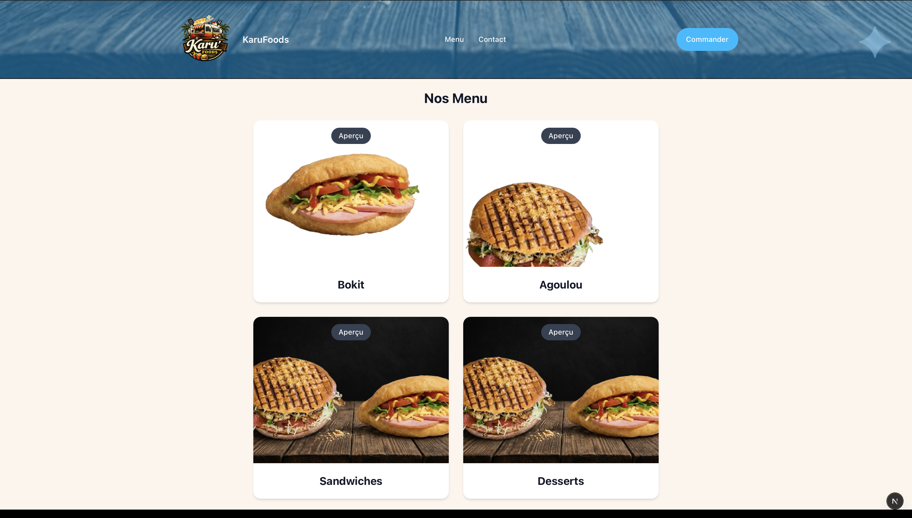


*Page d’accueil : navbar, hero, lien Menu / Contact.*

---

### Modal de commande

<!-- ex:  -->
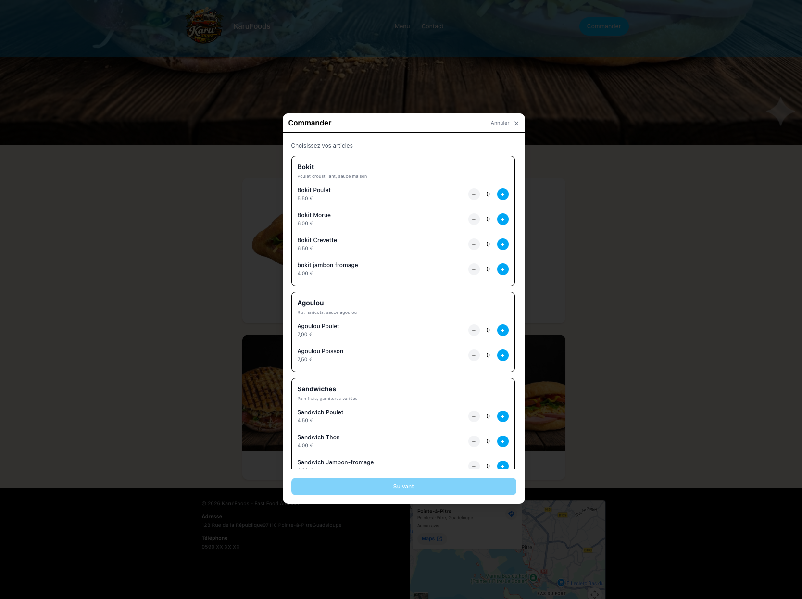
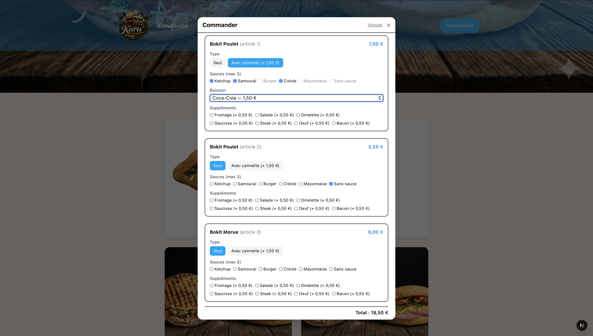
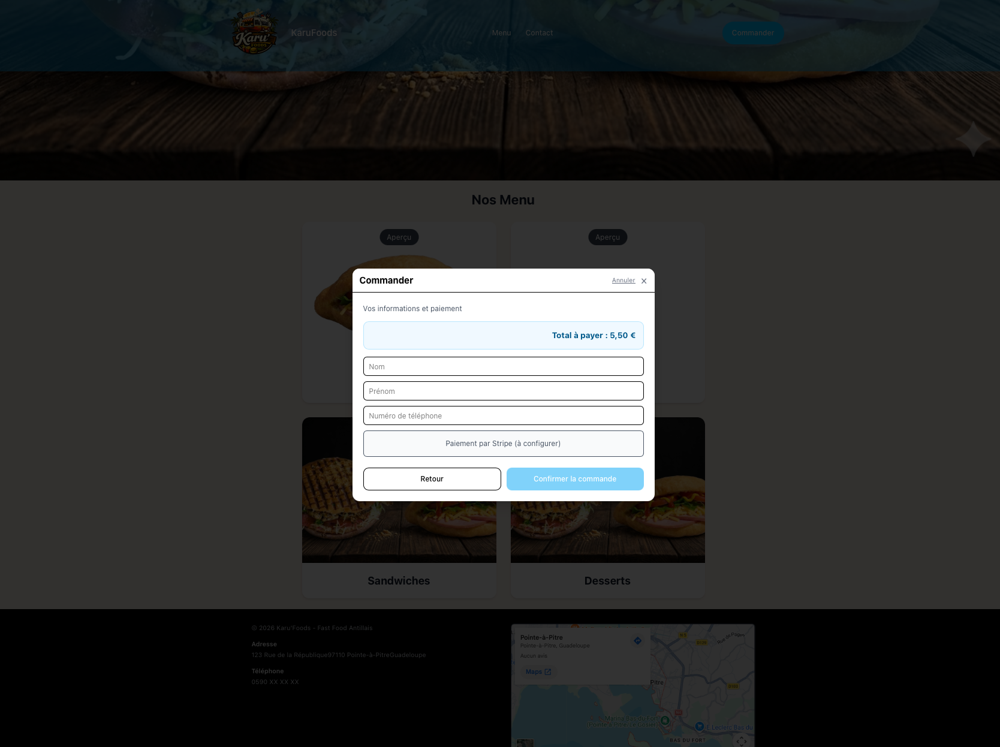
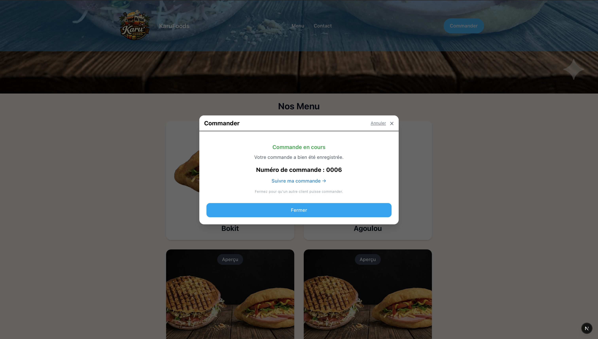

*Étapes du modal : choix emporter/sur place, catégories et plats, options (type, sauces, boisson, suppléments), total et confirmation.*

---

### Dashboard admin — Commandes

<!-- ex:  -->
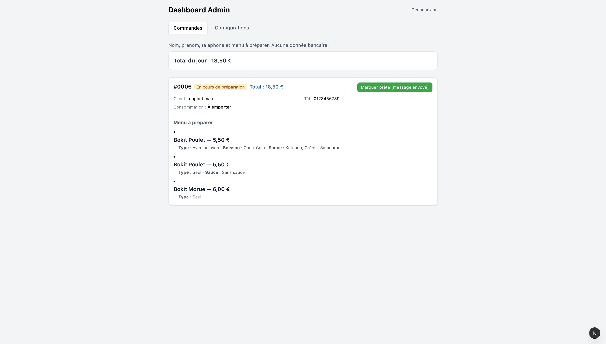

*Liste des commandes du jour, total par commande, total du jour, bouton « Marquer prête ».*

---

### Dashboard admin — Configurations

<!-- ex:  -->
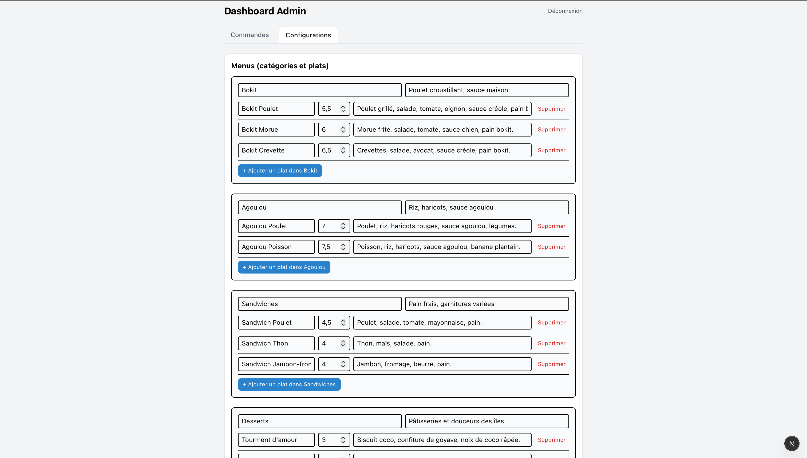
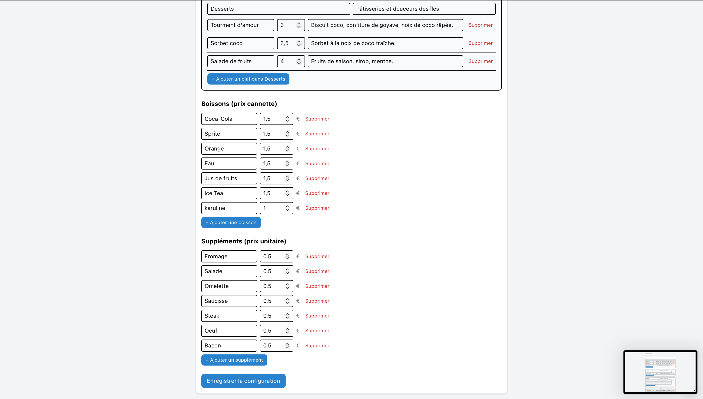


*Édition des menus (plats, prix, descriptions), boissons et suppléments ; ajout / suppression de lignes.*

---

### Suivi de commande


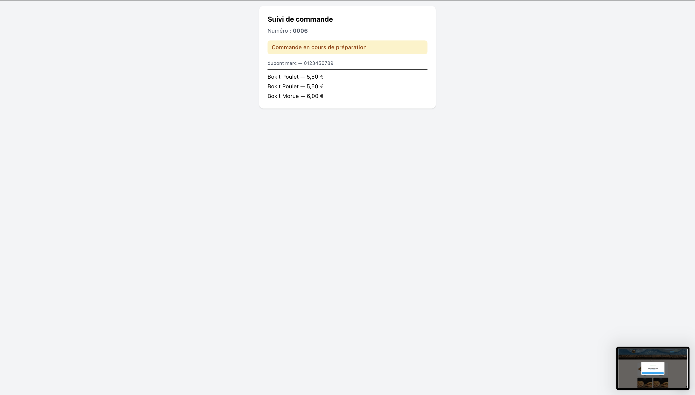

<!-- *Page `/commande/[id]?token=xxx` : statut de la commande.* -->

---

### version mobile

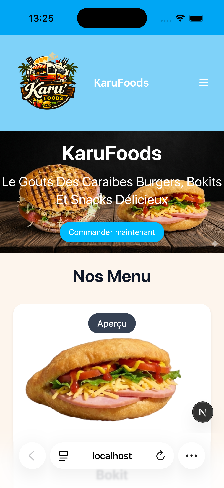
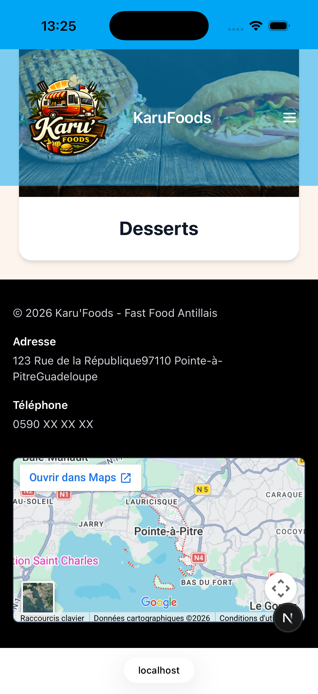
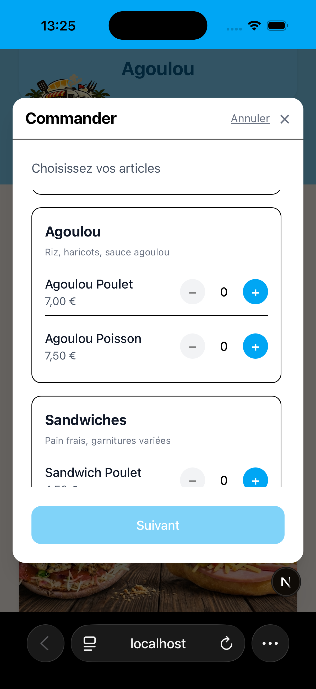
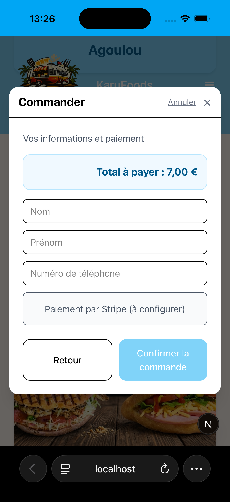


<!-- *Page `/commande/[id]?token=xxx` : statut de la commande.* -->

---


### Action de commande


vidéo gif d'une commande
---
### Action & config de la partie Admin


vidéo gif de l'administrateur
---

Pour remplacer les placeholders par de vraies images :
1. Créer un dossier `docs/` à la racine du projet (ou utiliser `public/`).
2. Y déposer tes captures (ex. `apercu-accueil.png`, `apercu-modal-commande.png`, etc.).
3. Adapter les chemins ci-dessus si besoin (ex. `./public/apercu-accueil.png`).
